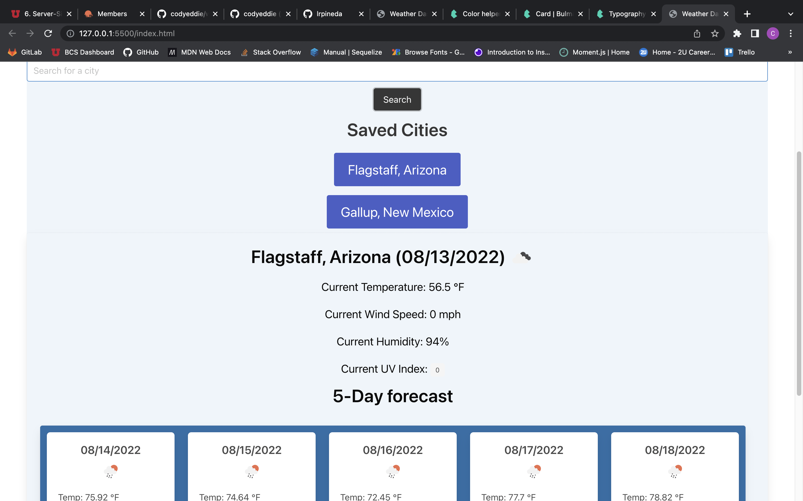

# Weather Dashboard

## Purpose 
This web applications uses the <a href="https://openweathermap.org/api">Open Weather Map API</a> to allow user to search for a city and see a 5 day weather forecast for that city. Searched cities will be saved to local storage so user can use easily get a forecast for that city at a later time if needed. 

## Table of Contents
* [Technologies](#technologies)
* [Resources](#resources)
* [Deployed Application](#live-link)
* [Contribution](#contributions)

## Technologies
* HTML
* CSS
* <a href="https://bulma.io/documentation/">Bulma CSS Framework</a>
* JavaScript
* jQuery
* <a href="https://openweathermap.org/api">Open Weather Map API</a>

## Resources
I utilized my tutor and referenced previous module work and lessons to complete this assignment. 

# Link

<a href="https://codyeddie.github.io/weather-dashboard/">Weather-Dashboard</a>

# Contributions
Made by <a href="https://github.com/codyeddie">Cody Eddie</a>